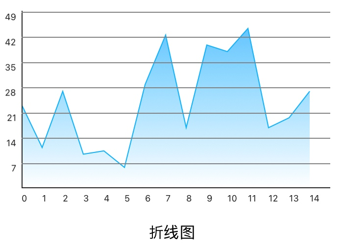

# LJCoordinate

通过输入点的集合生成一段曲线或者一张折线图表或曲线图表。

可以自定义是否使用参考线，线段粗细，颜色，背景颜色等等。

使用示例:

```
        let frame: CGRect = CGRect(x: 20, y: 200, width: SCREEN_WIDTH - WidthScale(40), height: WidthScale(200))
        coordinateV = LJCoordinateView(frame: frame, isAnimated: true, isSmooth: true)
        
        var arr: [LJCoordinatePointModel] = []
        for i in 0 ..< 15{
            let model = LJCoordinatePointModel(withXVal: "\(i)")
            model.yVal = CGFloat(arc4random() % 50)
            arr.append(model)
            print(model.yVal)
        }
        coordinateV.pointsArr = arr
        
        view.addSubview(coordinateV)
```

效果：





